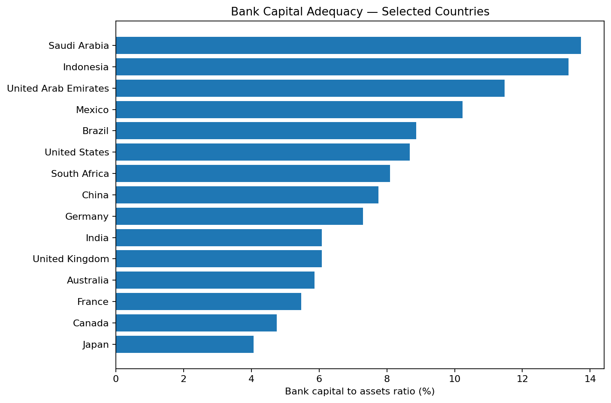
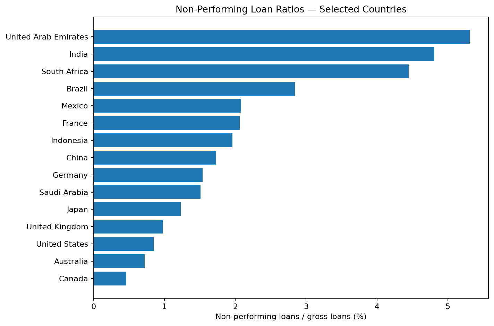
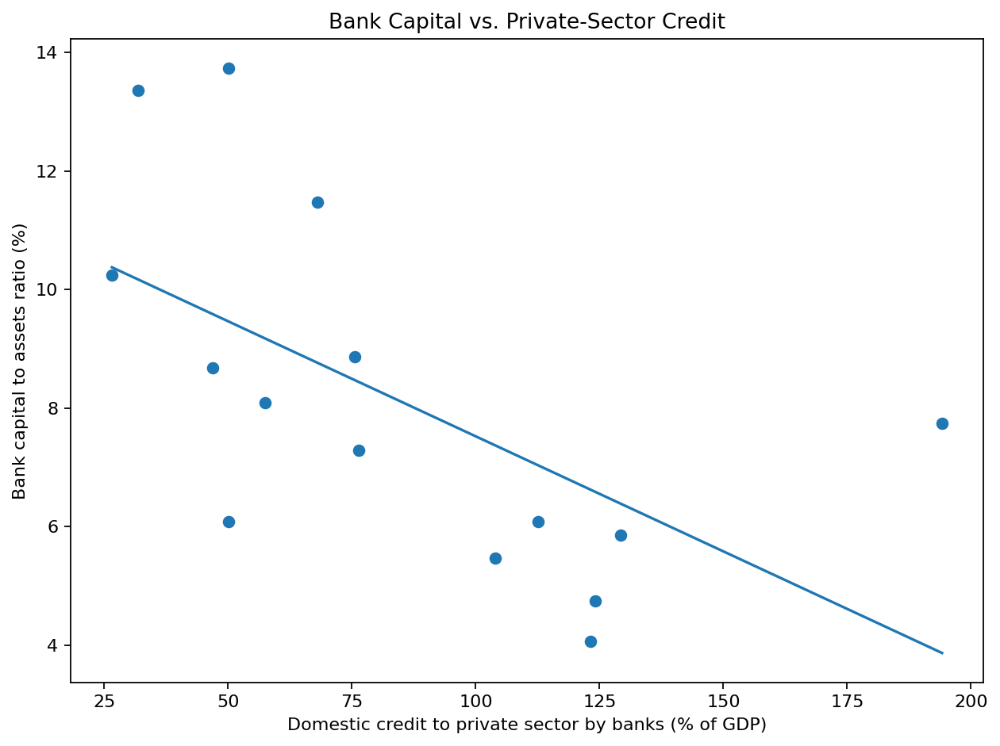
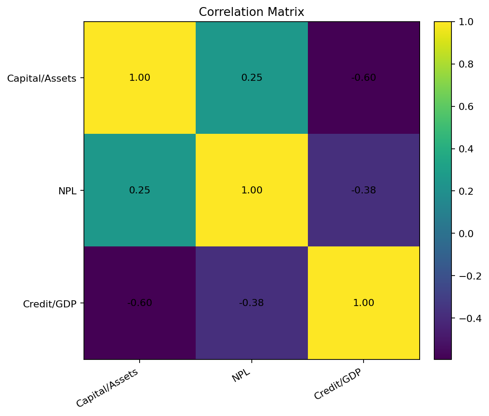

# Week 1 — Understanding Financial Data

## 📊 Project Overview

This project explores publicly available banking and financial-system data from the **World Bank World Development Indicators (WDI)**.

The objective was to understand a complete financial-data workflow, beginning with data acquisition and preparation and continuing through exploratory data analysis, visualization, correlation analysis, and financial interpretation.

The analysis uses a 15-country sample covering developed and emerging economies.

---

## 🎯 Objectives

- Acquire publicly available financial data
- Understand financial indicators and their definitions
- Clean and validate the dataset
- Perform descriptive analysis
- Compare banking-system conditions across countries
- Explore relationships between financial indicators
- Create meaningful financial visualizations
- Communicate findings through a structured report

---

## 📁 Dataset

The analysis uses three World Bank indicators.

| Indicator | World Bank Code | Description |
|---|---|---|
| Bank capital to assets | `FB.BNK.CAPA.ZS` | Bank capital and reserves relative to total assets (%) |
| Non-performing loans | `FB.AST.NPER.ZS` | Nonperforming loans relative to total gross loans (%) |
| Private-sector credit | `FD.AST.PRVT.GD.ZS` | Domestic credit to the private sector provided by banks (% of GDP) |

The observation year is retained for each indicator because the latest available year can differ across countries and indicators.

---

## 🌍 Countries Included

The analysis uses a 15-country sample:

- Australia
- Brazil
- Canada
- China
- France
- India
- Indonesia
- Japan
- Mexico
- Saudi Arabia
- South Africa
- Thailand
- United Arab Emirates
- United Kingdom
- United States

The sample provides a mixture of developed and emerging economies for comparative analysis.

---

## 🔍 Analysis Workflow

**World Bank Financial Data**

↓

**Data Acquisition**

↓

**Data Cleaning & Validation**

↓

**Descriptive Statistics**

↓

**Exploratory Data Analysis**

↓

**Cross-Country Comparison**

↓

**Correlation Analysis**

↓

**Financial Visualization**

↓

**Financial Insights**

↓

**Final Report**

---

# 📊 Visualizations

## 1. Bank Capital-to-Assets Ratio

This visualization compares bank capital and reserves relative to total assets across the selected countries.

A higher ratio indicates a larger capital position relative to total assets. However, this indicator alone should not be interpreted as a complete measure of capital adequacy because regulatory frameworks, asset composition, and risk weights also matter.

[Open Full-Size Capital Ratio Chart](01_bank_capital_ratio.png)

---

## 2. Non-Performing Loans

This visualization compares non-performing loans relative to gross loans.

NPL ratios provide an indication of loan-portfolio asset quality. Higher NPL ratios can indicate greater credit stress, although differences in reporting practices and economic conditions should be considered.

[Open Full-Size NPL Chart](02_npl_ratio.png)

---

## 3. Capital vs. Private-Sector Credit

This scatter plot examines the relationship between bank capital-to-assets and private-sector credit relative to GDP.

A scatter plot is appropriate because the objective is to explore the relationship between two continuous financial indicators.

The observed relationship is exploratory and should not be interpreted as evidence of causation.

[Open Full-Size Capital vs Credit Chart](03_capital_vs_credit.png)

---

## 4. Correlation Matrix

The correlation matrix summarizes the linear relationships between the financial indicators.

Correlation values closer to:

- `+1` indicate a strong positive linear relationship
- `0` indicate little linear relationship
- `-1` indicate a strong negative linear relationship

Correlation measures association and does not establish causation.

[Open Full-Size Correlation Matrix](04_correlation_matrix.png)

---

# 📈 Exploratory Findings

The analysis demonstrates meaningful differences in banking-system conditions across the selected countries.

### Bank Capital

The bank capital-to-assets ratio varies substantially across the sample, highlighting differences in reported banking-system capitalization.

### Non-Performing Loans

NPL ratios also differ considerably between countries, indicating variation in reported loan-portfolio quality.

### Private-Sector Credit

Private-sector credit relative to GDP shows particularly large differences across economies, reflecting differences in banking-system credit depth and financial development.

### Relationships Between Indicators

Correlation and scatter-plot analysis provide an initial view of relationships between capitalization, asset quality, and credit conditions.

These relationships are exploratory and should not be interpreted as causal relationships.

---

# 🧠 Key Analytical Takeaways

The Week 1 analysis demonstrates that banking-system conditions cannot be evaluated using a single financial indicator.

Three complementary dimensions were examined:

**Capitalization**

Bank capital relative to assets provides information about the capital position of the banking system.

**Asset Quality**

NPL ratios provide information about the quality of the loan portfolio.

**Credit Depth**

Private-sector credit relative to GDP provides an indication of the depth of bank-provided credit within the economy.

Together, these indicators provide a broader perspective than any individual measure.

---

## 🛠️ Tools & Technologies

- **Python**
- **Pandas** — data preparation and analysis
- **NumPy** — numerical analysis
- **Matplotlib** — visualization
- **Jupyter Notebook** — exploratory analysis
- **World Bank World Development Indicators** — financial data source
- **GitHub** — project version control and documentation

---

## 📄 Project Files

### Report

[Week 1 Financial Data EDA Report](Week1_Financial_Data_EDA_Report.docx)

### Dataset

[Financial Data CSV](financial_data.csv)

### Jupyter Notebook

[Financial EDA Notebook](financial_eda.ipynb)

### Python Analysis

[Financial EDA Python Script](financial_eda.py)

### Python Dependencies

[Requirements File](requirements.txt)

### Visualizations

[Bank Capital-to-Assets Chart](01_bank_capital_ratio.png)

[Non-Performing Loans Chart](02_npl_ratio.png)

[Capital vs Private Credit Chart](03_capital_vs_credit.png)

[Correlation Matrix](04_correlation_matrix.png)

---

# ⚠️ Limitations

The analysis has several limitations:

- The sample contains only 15 countries.
- Observation years can differ between countries and indicators.
- The indicators are aggregate financial measures.
- Bank-level information is not included.
- Correlation does not establish causation.
- Economic and institutional variables are not included in the analysis.

The results should therefore be interpreted as exploratory financial analysis.

---

# 🚀 Future Improvements

Future analysis could include:

- A larger country sample
- Synchronized observation years
- Multi-year panel datasets
- Additional macroeconomic indicators
- Bank-level financial data
- Time-series analysis
- Interactive Power BI dashboards
- Automated World Bank API data collection
- More advanced statistical modelling

---

## 🔗 Project Navigation

**Next:** [Week 2 — Creating Financial Forecasts](../Week%202)

**Main Project:** [Financial Data Analytics Internship](../)
