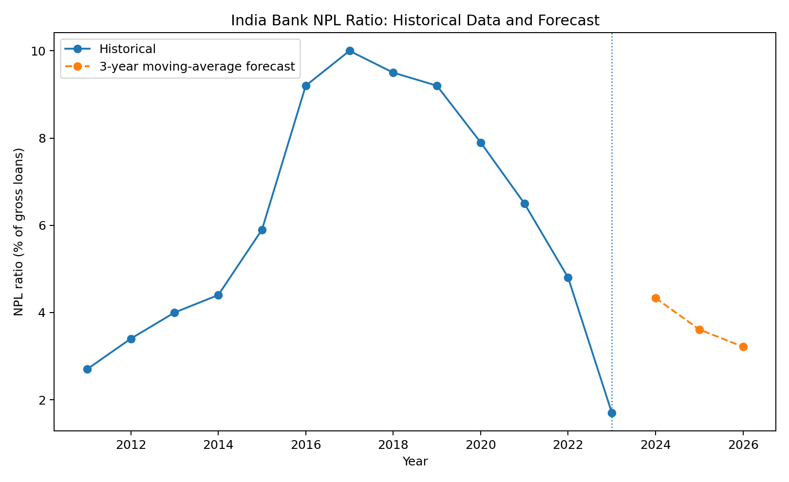

# Week 2 — Creating Financial Forecasts

## 📊 Project Overview

This week extends the Week 1 financial-data analysis into financial forecasting.

The objective was to select a financial indicator, design a simple forecasting model, implement the model, generate forecasts, and evaluate the usefulness and limitations of the approach.

India's **Non-Performing Loan (NPL) ratio** was selected as the forecasting indicator because it provides an important measure of banking-sector asset quality and has a historical annual time series suitable for a basic forecasting exercise.

---

## 🎯 Objectives

- Select an appropriate financial indicator for forecasting
- Prepare historical financial data
- Design a forecasting methodology
- Implement the model using Python
- Generate future estimates
- Visualize the forecast
- Evaluate the model and its limitations
- Document the methodology and results

---

## 📁 Financial Indicator

### Non-Performing Loans

**Indicator:** Non-performing loans to total gross loans (%)

**World Bank Code:** `FB.AST.NPER.ZS`

The indicator measures non-performing loans relative to total gross loans.

A higher NPL ratio generally indicates greater stress within a loan portfolio, while a lower ratio generally indicates better reported asset quality.

---

## 🧠 Forecasting Method

A **three-year moving average** was selected as the forecasting model.

The forecast is calculated using the average of the previous three observations:

**Forecast(t) = [Value(t-1) + Value(t-2) + Value(t-3)] / 3**

For subsequent forecast years, the model uses the most recent available observations, including previous forecast values.

### Why a Three-Year Moving Average?

The model was selected because it is:

- Simple
- Transparent
- Easy to reproduce
- Easy to explain
- Appropriate as a baseline forecasting method

The objective was to create a basic and understandable financial forecast rather than a highly complex time-series model.

---

## 📈 Forecast Results

| Year | Forecast NPL Ratio |
|---|---:|
| 2024 | 4.33% |
| 2025 | 3.61% |
| 2026 | 3.21% |

These values are **model estimates** and should not be interpreted as guaranteed future outcomes.

---

## 📊 Forecast Visualization

The chart below compares the historical India NPL ratio with the forecast period.

---

## 🔍 Analysis

The forecast provides a simple baseline for the expected direction of the NPL ratio based on recent historical observations.

The model indicates a declining forecast path across the forecast period. However, the result should be interpreted carefully because the moving-average model does not explicitly account for economic shocks, changes in regulation, credit conditions, or other macroeconomic factors.

---

## 🛠️ Tools & Technologies

- **Python**
- **Pandas**
- **NumPy**
- **Matplotlib**
- **World Bank World Development Indicators**
- **Jupyter / Python environment**
- **GitHub**

---

## 🔄 Analysis Workflow

**Historical World Bank Data**

↓

**Data Preparation**

↓

**Indicator Selection**

↓

**Model Design**

↓

**Three-Year Moving Average**

↓

**Forecast Generation**

↓

**Visualization**

↓

**Analysis & Reporting**

---

## ⚠️ Limitations

The moving-average approach is intentionally simple and does not explicitly model:

- GDP growth
- Inflation
- Interest rates
- Unemployment
- Credit growth
- Banking-sector regulation
- Economic shocks
- Structural breaks

The model therefore represents a **baseline forecast**, rather than a comprehensive financial prediction.

Forecast uncertainty should also be considered when interpreting the results.

---

## 🚀 Future Improvements

Potential improvements include:

- Exponential smoothing
- ARIMA or other time-series models
- Longer historical datasets
- Prediction intervals
- Macroeconomic explanatory variables
- Model back-testing
- Comparison of multiple forecasting methods
- Automated data updates from the World Bank API

---

## 📄 Project Files

### Report

[Week 2 Financial Forecast Report](Week2_Financial_Forecast_Report.docx)

### Forecast Dataset

[India NPL Forecast Dataset](Week2_India_NPL_Forecast.csv)

### Python Script

[Financial Forecasting Python Script](week2_financial_forecast.py)

### Submission Description

[Week 2 Submission Description](Week2_Submission_Description.txt)

### Forecast Visualization

[Open Forecast Chart](Week2_India_NPL_Forecast.png)

---

## 🔗 Project Navigation

**Previous:** [Week 1 — Understanding Financial Data](../Week%201)

**Next:** [Week 3 — Risk Analysis](../Week%203)

**Main Project:** [Financial Data Analytics Internship](../)
