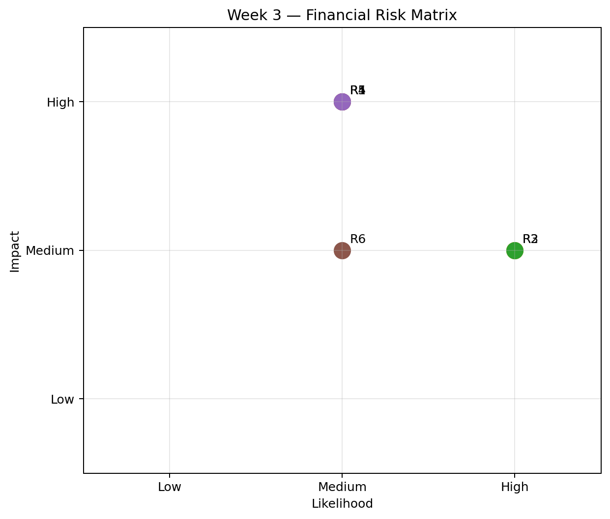

# Week 3 — Risk Analysis

## 📊 Project Overview

This week focuses on identifying, assessing, and managing potential financial and analytical risks using the banking indicators developed during the previous weeks.

The objective was to identify potential risks, evaluate their likelihood and impact, prioritize them, and propose practical mitigation strategies.

The analysis considers risks related to asset quality, capital adequacy, credit conditions, forecasting uncertainty, and data quality.

---

## 🎯 Objectives

- Identify potential financial risks
- Identify analytical and data-related risks
- Assess the likelihood of each risk
- Assess the potential impact of each risk
- Prioritize risks using a risk matrix
- Develop appropriate mitigation strategies
- Communicate the results through a structured risk analysis report

---

## 🔍 Risk Analysis Framework

The analysis uses two primary dimensions:

### Likelihood

How likely the identified risk is to occur.

### Impact

The potential severity of the consequences if the risk occurs.

The combination of likelihood and impact is used to prioritize risks.

---

## ⚠️ Key Risks Identified

| Risk | Category | Potential Impact |
|---|---|---|
| Increase in Non-Performing Loans | Financial | Deterioration in asset quality |
| Capital Adequacy Pressure | Financial | Reduced ability to absorb losses |
| Credit-Cycle Risk | Financial | Increased exposure to changes in credit conditions |
| Forecast Uncertainty | Analytical | Forecasts may differ materially from actual outcomes |
| Data Quality Risk | Data | Incorrect or inconsistent conclusions |
| Data Timing / Comparability Risk | Data | Cross-country comparisons may be misleading |

---

## 📊 Risk Matrix

The following matrix summarizes the assessed risks according to their likelihood and potential impact.

---

## 🧠 Risk Assessment

### 1. Non-Performing Loan Risk

An increase in NPLs can indicate deterioration in the quality of a banking system's loan portfolio.

Higher NPL levels can potentially reduce profitability, increase provisioning requirements, and place pressure on bank capital.

**Mitigation:**

- Monitor NPL trends
- Strengthen credit-risk monitoring
- Review loan portfolio quality
- Improve early-warning systems

---

### 2. Capital Adequacy Risk

Insufficient capital can reduce a bank's ability to absorb unexpected losses.

Bank capital should therefore be monitored alongside asset quality and credit exposure.

**Mitigation:**

- Monitor capital ratios
- Maintain appropriate capital buffers
- Conduct stress testing
- Review capital planning regularly

---

### 3. Credit-Cycle Risk

Rapid increases or declines in private-sector credit can affect financial-system stability.

Excessive credit expansion may increase leverage and future credit losses, while a sharp contraction can reduce economic activity.

**Mitigation:**

- Monitor credit growth
- Track borrower leverage
- Monitor sector concentration
- Use scenario analysis

---

### 4. Forecast Uncertainty

Financial forecasts are estimates and can differ from actual future outcomes.

The Week 2 moving-average forecast is particularly sensitive to the historical observations used by the model.

**Mitigation:**

- Compare multiple forecasting methods
- Perform back-testing
- Use prediction intervals
- Incorporate additional economic variables

---

### 5. Data Quality Risk

Incorrect, incomplete, or inconsistent data can lead to incorrect analytical conclusions.

This is especially important when combining data from different indicators or observation periods.

**Mitigation:**

- Validate datasets
- Check for missing values
- Verify indicator definitions
- Maintain consistent data sources
- Document data transformations

---

### 6. Data Timing and Comparability Risk

The latest available observation can differ between countries and indicators.

This means that cross-country comparisons may combine observations from different years.

**Mitigation:**

- Use synchronized observation years
- Clearly document observation dates
- Avoid overstating cross-country conclusions
- Build panel datasets for future analysis

---

## 🛠️ Tools & Technologies

- **Python**
- **Pandas**
- **NumPy**
- **Matplotlib**
- **World Bank World Development Indicators**
- **GitHub**

---

## 🔄 Analysis Workflow

**Financial Data**

↓

**Risk Identification**

↓

**Likelihood Assessment**

↓

**Impact Assessment**

↓

**Risk Prioritization**

↓

**Mitigation Strategies**

↓

**Risk Report**

---

## 📄 Project Files

### Risk Analysis Report

[Week 3 Risk Analysis Report](Week3_Risk_Analysis_Report.docx)

### Risk Register

[Week 3 Risk Register](Week3_Risk_Register.csv)

### Risk Matrix

[Open Risk Matrix](Week3_Risk_Matrix.png)

### Python Analysis

[Risk Analysis Python Script](week3_risk_analysis.py)

### Submission Description

[Week 3 Submission Description](Week3_Submission_Description.txt)

---

## ⚠️ Limitations

This analysis is an educational risk assessment rather than a professional banking-sector stress test.

The identified risks are based on aggregate financial indicators and do not include detailed bank-level information.

Risk assessments can also change as economic conditions, regulations, credit conditions, and financial-market conditions change.

---

## 🚀 Future Improvements

Future versions of the analysis could include:

- Bank-level financial data
- Probability-of-default models
- Loss-given-default analysis
- Stress-testing scenarios
- Macroeconomic variables
- Credit concentration analysis
- Liquidity risk indicators
- Capital stress testing
- Automated risk monitoring

---

## 🔗 Project Navigation

**Previous:** [Week 2 — Creating Financial Forecasts](../Week%202)

**Next:** [Week 4 — Hypothesis Testing](../Week%204)

**Main Project:** [Financial Data Analytics Internship](../)
