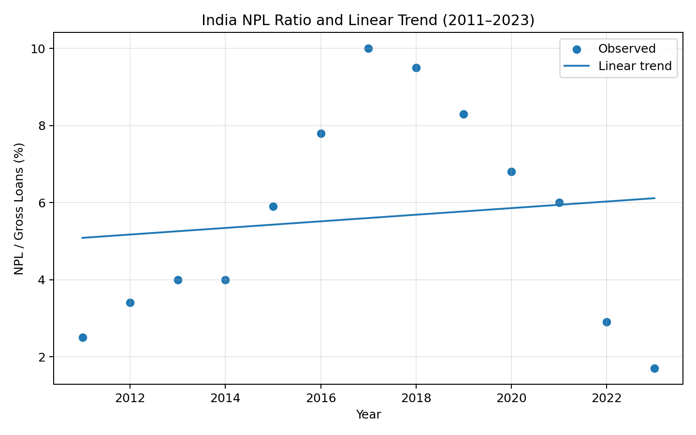

# Week 4 — Hypothesis Testing

## 📊 Project Overview

This week focuses on applying statistical hypothesis testing to financial data.

The objective was to formulate a testable hypothesis using India's historical Non-Performing Loan (NPL) ratio, select an appropriate statistical method, perform the test using Python, and interpret the results.

The analysis examines whether there is a statistically significant linear relationship between **calendar year and India's NPL ratio**.

---

## 🎯 Objectives

- Formulate a financial hypothesis
- Define null and alternative hypotheses
- Select an appropriate statistical test
- Perform the analysis using Python
- Evaluate statistical significance
- Interpret the results
- Discuss limitations and implications

---

## 📁 Financial Indicator

### Non-Performing Loans

**Indicator:** Non-performing loans to total gross loans (%)

**World Bank Code:** `FB.AST.NPER.ZS`

The NPL ratio measures non-performing loans relative to total gross loans and is commonly used as an indicator of loan-portfolio asset quality.

---

## 🧪 Hypothesis

The analysis investigates whether India's NPL ratio has a statistically significant linear relationship with calendar year.

### Null Hypothesis — H₀

There is **no linear relationship** between calendar year and India's NPL ratio.

### Alternative Hypothesis — H₁

There **is a linear relationship** between calendar year and India's NPL ratio.

The significance level used for the hypothesis test is:

**α = 0.05**

---

## 📐 Statistical Method

A **Pearson correlation test** was used to measure the strength and direction of the linear relationship between year and the NPL ratio.

A simple linear regression was also used to examine the estimated trend.

### Pearson Correlation

The Pearson correlation coefficient ranges from:

- `-1` — perfect negative linear relationship
- `0` — no linear relationship
- `+1` — perfect positive linear relationship

The p-value determines whether the observed relationship is statistically significant at the selected significance level.

---

## 📊 Results

Using the historical India NPL series underlying the forecasting analysis:

**Pearson correlation:** approximately **-0.89**

**Statistical significance:** **p < 0.001**

**Significance level:** **α = 0.05**

Because the p-value is below 0.05, the null hypothesis is rejected.

### Conclusion

There is statistically significant evidence of a **negative linear relationship between calendar year and India's NPL ratio in the selected historical sample**.

In simple terms, the NPL ratio shows a statistically significant downward trend over the period analyzed.

However, this result does **not** prove that the passage of time itself causes NPL ratios to decline.

---

## 📈 Hypothesis Test Visualization

The visualization illustrates the historical NPL observations and the relationship examined in the statistical analysis.

---

## 🔍 Interpretation

The negative correlation indicates that India's reported NPL ratio generally declined as the historical observation year increased.

The statistical significance suggests that the observed linear relationship is unlikely to have occurred by random sampling variation alone under the assumptions of the test.

However, several factors may have contributed to the observed trend, including:

- Economic conditions
- Banking-sector reforms
- Loan-recognition practices
- Credit-cycle changes
- Provisioning and resolution practices
- Changes in the composition of bank lending

Therefore, the statistical result should be interpreted as evidence of an association rather than evidence of causation.

---

## 📊 Regression Analysis

A simple linear regression was also performed to quantify the estimated trend.

The regression coefficient represents the estimated change in the NPL ratio associated with a one-year increase in the year variable.

The regression analysis supports the negative relationship identified by the Pearson correlation test.

The model should nevertheless be interpreted cautiously because the historical sample is relatively small and time-series observations may violate some assumptions of simple statistical tests.

---

## 🛠️ Tools & Technologies

- **Python**
- **Pandas**
- **NumPy**
- **SciPy**
- **Matplotlib**
- **World Bank World Development Indicators**
- **GitHub**

---

## 🔄 Analysis Workflow

**Financial Time-Series Data**

↓

**Hypothesis Formulation**

↓

**Null & Alternative Hypotheses**

↓

**Pearson Correlation Test**

↓

**Regression Analysis**

↓

**Statistical Significance**

↓

**Interpretation**

↓

**Limitations & Conclusions**

---

## ⚠️ Limitations

The analysis has several limitations:

- The historical sample is relatively small.
- The observations represent aggregate financial data.
- A statistical relationship does not establish causation.
- Time-series observations may not be fully independent.
- Other economic variables are not included in the model.
- Changes in reporting and banking regulations may influence NPL measurements.

Therefore, the results should be considered **exploratory statistical evidence** rather than a complete explanation of India's NPL dynamics.

---

## 🚀 Future Improvements

Future analysis could include:

- Longer historical datasets
- Time-series-specific statistical methods
- Stationarity testing
- Autocorrelation testing
- Multiple regression
- GDP growth
- Inflation
- Interest rates
- Credit growth
- Unemployment
- Banking-sector reforms
- Macroeconomic control variables

A larger dataset would also allow more robust statistical modelling.

---

## 📄 Project Files

### Hypothesis Testing Report

[Week 4 Hypothesis Testing Report](Week4_Hypothesis_Testing_Report.docx)

### Analysis Dataset

[India NPL Hypothesis Testing Dataset](Week4_India_NPL_Hypothesis_Test.csv)

### Visualization

[Open Hypothesis Test Chart](Week4_India_NPL_Hypothesis_Test.png)

### Python Analysis

[Hypothesis Testing Python Script](week4_hypothesis_testing.py)

### Submission Description

[Week 4 Submission Description](Week4_Submission_Description.txt)

---

## 🔗 Project Navigation

**Previous:** [Week 3 — Risk Analysis](../Week%203)

**Next:** [Week 5 — Data Visualization](../Week%205)

**Main Project:** [Financial Data Analytics Internship](../)
