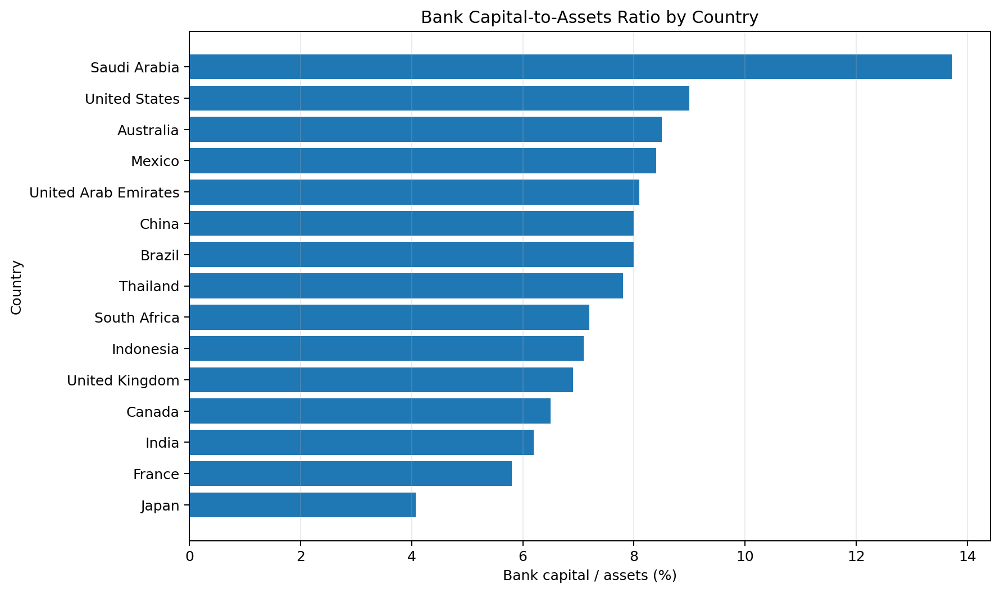
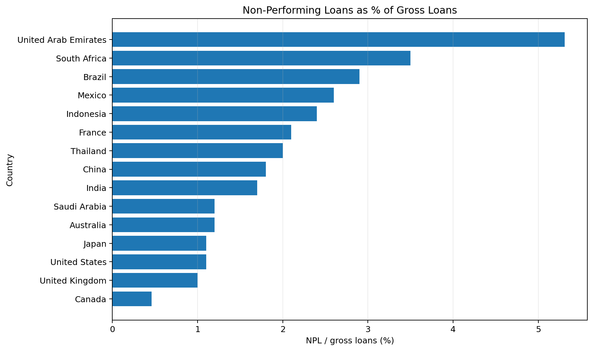
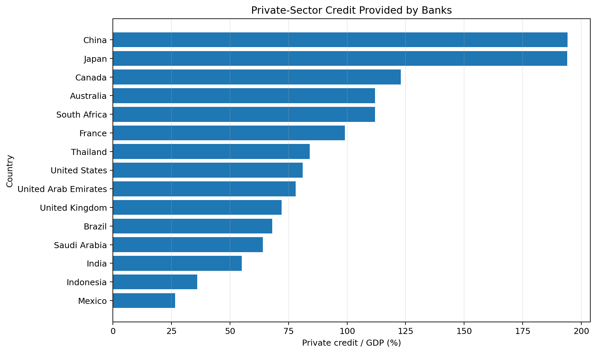
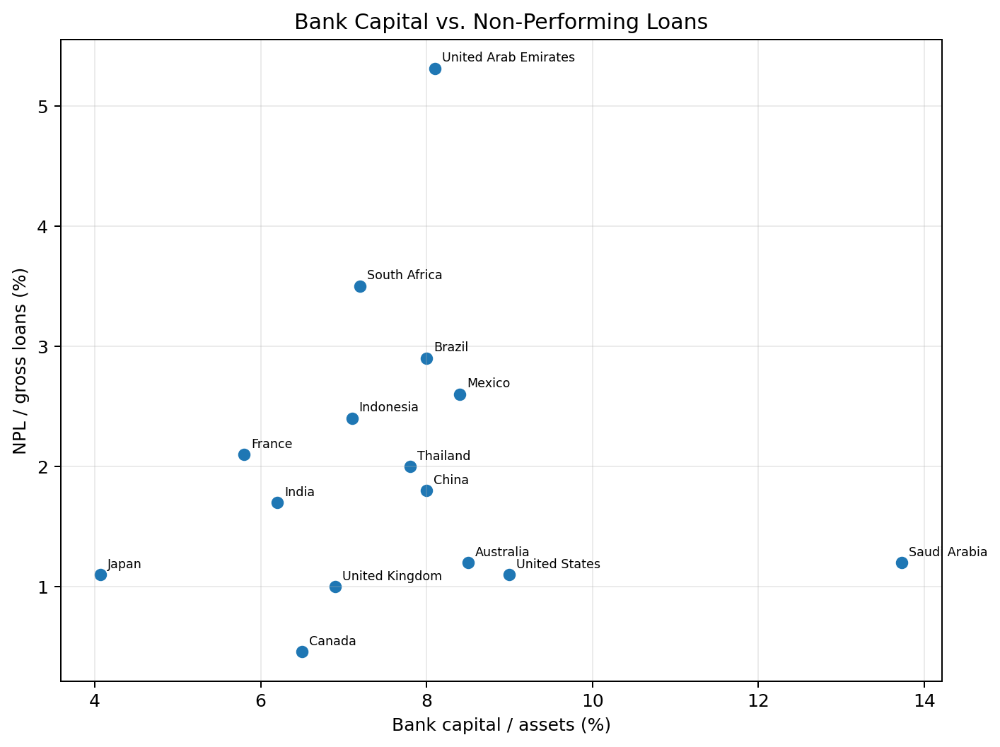
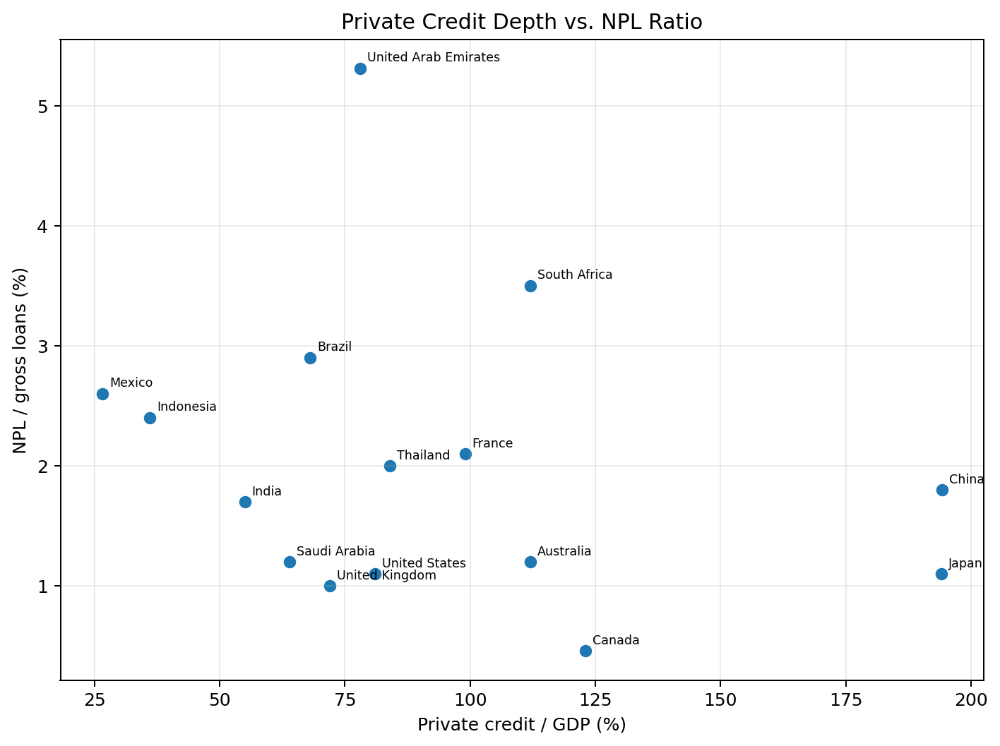
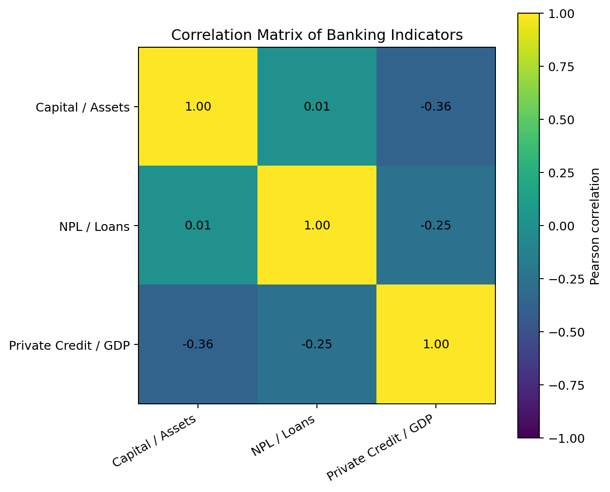

# Week 5 — Data Visualization

## 📊 Project Overview

This week focuses on using data visualization to communicate patterns and relationships within the financial dataset developed during the previous weeks.

The objective was to create meaningful visualizations that make financial comparisons easier to understand and to select chart types based on the analytical question being addressed.

The analysis uses three banking-system indicators:

- Bank capital to assets
- Non-performing loans
- Private-sector credit

---

## 🎯 Objectives

- Select appropriate financial data for visualization
- Compare banking indicators across countries
- Identify patterns and differences within the dataset
- Explore relationships between financial indicators
- Use appropriate chart types for different analytical questions
- Communicate financial findings clearly through visualizations

---

## 📁 Dataset

The analysis uses a 15-country sample and three World Bank financial indicators.

| Indicator | World Bank Code |
|---|---|
| Bank capital to assets | `FB.BNK.CAPA.ZS` |
| Non-performing loans | `FB.AST.NPER.ZS` |
| Private-sector credit | `FD.AST.PRVT.GD.ZS` |

---

# 📊 Visualizations

## 1. Bank Capital-to-Assets Ratio

This ranked bar chart compares bank capital relative to total assets across the selected countries.

A horizontal bar chart was selected because the primary objective is to compare countries and identify their relative rankings.

[Open Full-Size Capital Chart](Week5_01_Bank_Capital.png)

---

## 2. Non-Performing Loans

This visualization compares non-performing loans as a percentage of gross loans across the selected countries.

Higher NPL ratios can indicate greater stress in a loan portfolio, although interpretation should consider differences in reporting standards and economic conditions.

[Open Full-Size NPL Chart](Week5_02_NPL_Ratio.png)

---

## 3. Private-Sector Credit

This chart compares domestic private-sector credit provided by banks relative to GDP.

The visualization highlights differences in banking-system credit depth across the selected countries.

A high private-credit-to-GDP ratio is not automatically positive or negative. It can reflect financial development, but excessive credit expansion may also increase financial vulnerability.

[Open Full-Size Private Credit Chart](Week5_03_Private_Credit.png)

---

## 4. Bank Capital vs. Non-Performing Loans

This scatter plot examines the relationship between bank capital-to-assets and NPL ratios.

Scatter plots are appropriate here because both variables are continuous and the objective is to explore their relationship.

The visualization can also help identify countries that appear unusual relative to the rest of the sample.

[Open Full-Size Capital vs NPL Chart](Week5_04_Capital_vs_NPL.png)

---

## 5. Private Credit vs. Non-Performing Loans

This scatter plot examines the relationship between private-sector credit and NPL ratios.

The chart provides another perspective on the relationship between credit-market depth and loan quality.

The observed relationship should be treated as exploratory and should not be interpreted as evidence of causation.

[Open Full-Size Credit vs NPL Chart](Week5_05_Credit_vs_NPL.png)

---

## 6. Correlation Matrix

The correlation matrix provides a compact summary of the linear relationships between the three financial indicators.

Values closer to:

- `+1` indicate a strong positive linear relationship
- `0` indicate little linear relationship
- `-1` indicate a strong negative linear relationship

Correlation measures association and does not establish causation.

[Open Full-Size Correlation Matrix](Week5_06_Correlation_Matrix.png)

---

# 🔍 Key Findings

The visualization analysis highlights several important characteristics of the financial dataset.

### Different levels of banking-system capitalization

The selected countries show meaningful differences in bank capital-to-assets ratios.

This demonstrates that banking-system capitalization varies substantially across economies.

### Differences in asset quality

NPL ratios also vary across countries, indicating differences in reported loan-portfolio quality.

Countries with relatively high NPL ratios may warrant additional investigation into credit quality and banking-sector conditions.

### Large differences in credit depth

Private-sector credit shows particularly large cross-country differences.

Some banking systems provide substantially more bank credit relative to GDP than others.

### Relationships between indicators

The scatter plots allow potential relationships and outliers to be identified.

However, the relationships should be interpreted carefully because the dataset is relatively small and observation years can differ.

---

# 🧠 Visualization Design Principles

Different visualizations were selected for different analytical questions.

### Bar Charts

Used for country rankings and comparisons.

### Scatter Plots

Used to explore relationships between two continuous financial indicators.

### Correlation Matrix

Used to summarize pairwise linear relationships between indicators.

The main principle is that the visualization should support the analytical question rather than simply make the dataset look attractive.

---

# 🛠️ Tools & Technologies

- **Python**
- **Pandas**
- **NumPy**
- **Matplotlib**
- **World Bank World Development Indicators**
- **Jupyter / Python environment**
- **GitHub**

---

# 🔄 Analysis Workflow

**Financial Dataset**

↓

**Data Preparation**

↓

**Indicator Selection**

↓

**Exploratory Analysis**

↓

**Chart Selection**

↓

**Visualization**

↓

**Pattern Identification**

↓

**Financial Interpretation**

↓

**Reporting**

---

# ⚠️ Limitations

The analysis has several limitations:

- The sample contains only 15 countries.
- Observation years may differ across countries and indicators.
- The indicators are aggregate measures rather than bank-level data.
- Correlation does not establish causation.
- Important macroeconomic and institutional variables are not included.
- Visualization alone cannot explain the underlying causes of financial patterns.

Therefore, the visualizations should be interpreted as exploratory financial analysis.

---

# 🚀 Future Improvements

Future analysis could include:

- Larger country samples
- Synchronized observation years
- Multi-year panel datasets
- Interactive Power BI dashboards
- Additional macroeconomic indicators
- Bank-level financial data
- Time-series visualizations
- Geographic financial dashboards
- Automated World Bank API updates

---

# 📄 Project Files

## Report

[Week 5 Data Visualization Report](Week5_Data_Visualization_Report.docx)

## Dataset

[Week 5 Financial Visualization Dataset](Week5_Financial_Visualization_Data.csv)

## Correlation Data

[Week 5 Correlation Matrix Data](Week5_Correlation_Matrix.csv)

## Python Analysis

[Week 5 Visualization Python Script](week5_data_visualization.py)

## Submission Description

[Week 5 Submission Description](Week5_Submission_Description.txt)

---

# 🔗 Project Navigation

**Previous:** [Week 4 — Hypothesis Testing](../Week%204)

**Next:** [Week 6 — Reporting & Presentation](../Week%206)

**Main Project:** [Financial Data Analytics Internship](../)
