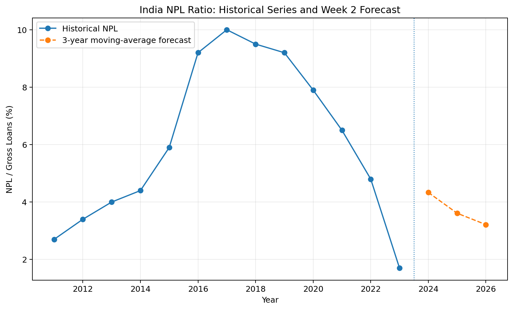

# Week 6 — Reporting and Presentation

## 📊 Project Overview

Week 6 is the final stage of the six-week financial data analytics project.

The objective was to consolidate the work completed during the previous weeks, summarize the key findings, identify important limitations, and propose recommendations for future analysis.

The final report brings together the complete workflow:

- Financial data acquisition
- Exploratory Data Analysis
- Financial forecasting
- Risk analysis
- Hypothesis testing
- Data visualization
- Final reporting

---

## 🎯 Objectives

- Review the work completed during Weeks 1–5
- Consolidate the major analytical findings
- Connect the different financial analyses
- Identify important insights and limitations
- Provide recommendations for future analysis
- Present the project in a clear and structured format

---

## 🗂️ Six-Week Project Journey

| Week | Topic | Main Focus |
|---|---|---|
| Week 1 | Understanding Financial Data | Data acquisition, cleaning and EDA |
| Week 2 | Creating Financial Forecasts | India NPL forecasting |
| Week 3 | Risk Analysis | Risk identification and mitigation |
| Week 4 | Hypothesis Testing | Statistical analysis |
| Week 5 | Data Visualization | Financial visualization |
| Week 6 | Reporting & Presentation | Consolidation and recommendations |

---

## 📈 Final Project Visualization

The following visualization summarizes the historical India NPL series together with the forecast developed during Week 2.

[Open Full-Size Visualization](Week6_India_NPL_History_Forecast.png)

The visualization demonstrates how the forecasting exercise connects the historical financial analysis with the forward-looking component of the project.

---

# 🔍 Key Findings

## 1. Banking-System Indicators Vary Significantly

The Week 1 analysis demonstrated meaningful differences across the selected countries in:

- Bank capital-to-assets ratios
- Non-performing loan ratios
- Private-sector credit

This reinforces the importance of examining multiple indicators when evaluating financial-system conditions.

---

## 2. Asset Quality Is an Important Risk Indicator

Non-performing loans provide an important measure of loan-portfolio quality.

Higher NPL ratios can indicate increased credit risk and may place pressure on profitability, provisioning and capital.

However, NPL ratios should always be interpreted in their economic and regulatory context.

---

## 3. Credit Depth Differs Across Economies

Private-sector credit relative to GDP varies substantially across countries.

A higher credit-to-GDP ratio can indicate greater financial development, but excessive credit expansion may also create additional financial vulnerabilities.

Therefore, credit depth should be considered together with asset quality and capitalization.

---

## 4. Forecasting Provides a Baseline, Not Certainty

The Week 2 analysis used a three-year moving-average model to forecast India's NPL ratio.

The model produced a declining baseline forecast for the selected forecast period.

However, financial forecasts are sensitive to:

- Historical data
- Model assumptions
- Economic conditions
- Financial shocks
- Changes in policy and regulation

Forecast results should therefore be interpreted as estimates rather than guaranteed outcomes.

---

## 5. Statistical Relationships Require Careful Interpretation

The Week 4 hypothesis test identified a statistically significant negative linear relationship between calendar year and India's NPL ratio in the selected historical sample.

However, statistical significance does not establish causation.

Other factors may have contributed to the observed trend, including:

- Economic conditions
- Banking-sector reforms
- Credit cycles
- Loan-recognition practices
- Provisioning and resolution practices

---

## 6. Visualization Improves Financial Communication

The Week 5 analysis demonstrated how different chart types can answer different analytical questions.

- Bar charts are useful for rankings.
- Scatter plots are useful for relationships.
- Correlation matrices summarize linear associations.
- Time-series charts help communicate trends.

Effective visualization makes financial analysis easier to interpret and communicate.

---

# 🧠 Integrated Project Insights

The six-week project demonstrates that financial analysis is most useful when multiple analytical approaches are combined.

A single financial indicator cannot fully describe the condition of a banking system.

Instead, analysts can combine:

**Capitalization**

+

**Asset Quality**

+

**Credit Conditions**

+

**Historical Trends**

+

**Forecasts**

+

**Risk Analysis**

+

**Statistical Testing**

to develop a more complete analytical perspective.

---

# ⚠️ Data Quality and Consistency

During final project consolidation, a consistency issue was identified between the historical India NPL series used in different weekly analyses.

The Week 2 historical series was used as the consistent reference for the final time-series interpretation because it is the series underlying the forecasting exercise.

The issue was documented rather than silently ignored.

This highlights an important principle of financial analytics:

**Data validation and consistency checks are essential before combining analytical results.**

---

# ⚠️ Project Limitations

The project has several important limitations:

- The cross-country sample is relatively small.
- Observation years may differ between countries and indicators.
- The analysis uses aggregate financial indicators.
- The forecasting methodology is intentionally simple.
- The hypothesis-testing sample is limited.
- Correlation does not establish causation.
- Important macroeconomic variables are not included.
- Bank-level financial information is not available in the dataset.

The results should therefore be interpreted as an educational analytical exercise rather than a professional banking-sector stress test or investment recommendation.

---

# 🚀 Recommendations for Future Analysis

Several improvements could make the analysis more comprehensive.

### 1. Expand the Dataset

Use larger cross-country and multi-year datasets.

### 2. Synchronize Observation Years

Build a consistent panel dataset where countries and indicators are measured over comparable periods.

### 3. Improve Forecasting

Compare multiple forecasting methods such as:

- Moving averages
- Exponential smoothing
- ARIMA
- Other time-series approaches

### 4. Add Macroeconomic Variables

Potential explanatory variables include:

- GDP growth
- Inflation
- Interest rates
- Unemployment
- Credit growth

### 5. Perform Stress Testing

Evaluate how financial shocks could affect:

- NPL ratios
- Bank capital
- Credit conditions

### 6. Build Interactive Dashboards

The project could be extended into an interactive **Power BI dashboard** allowing users to filter:

- Country
- Indicator
- Year
- Financial metric

### 7. Automate Data Collection

The World Bank API could be used to automatically update the dataset and refresh the analysis.

---

# 🛠️ Tools & Technologies

- **Python**
- **Pandas**
- **NumPy**
- **SciPy**
- **Matplotlib**
- **Jupyter Notebook**
- **World Bank World Development Indicators**
- **GitHub**

---

# 🔄 Complete Analytical Workflow

**Public Financial Data**

↓

**Data Acquisition**

↓

**Data Cleaning & Validation**

↓

**Exploratory Data Analysis**

↓

**Financial Forecasting**

↓

**Risk Analysis**

↓

**Hypothesis Testing**

↓

**Data Visualization**

↓

**Integrated Findings**

↓

**Recommendations**

---

# 📄 Final Project Files

## Final Report

[Week 6 Comprehensive Financial Analysis Report](Week6_Final_Comprehensive_Report.docx)

## Final Visualization

[India NPL History and Forecast](Week6_India_NPL_History_Forecast.png)

## Submission Description

[Week 6 Submission Description](Week6_Submission_Description.txt)

---

# 🔗 Project Navigation

**Previous:** [Week 5 — Data Visualization](../Week%205)

**Main Project:** [Financial Data Analytics Internship](../)

---

## 👤 Author

**Aditya Jadhav**

Bachelor of Business Administration — Business Analytics

This repository represents a six-week practical financial data analytics project covering data preparation, exploratory analysis, forecasting, risk analysis, statistical testing, visualization and professional reporting.
